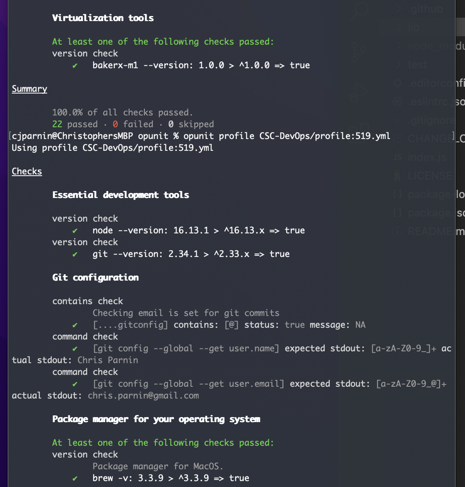

# Opunit🕵️‍ | 
Simple tool for doing sanity checks on vms, and containers and remote servers. Written in pure node.js


## Install with npm
```
npm install ottomatica/opunit -g
```

<p align="center">

</p>

## Using Opunit
Opunit uses a configuration file (opunit.yml) in the `/test` directory of you project. This is an example opunit.yml file. By running `opunit verify` in the root directory of your project, opunit runs the checks defined in the configuration file on the [environment of your project](#connectors); this can be a VM, container or even a remote server.

``` yml
- group:
    description: "Basic checks for startup"
    checks:
      - availability:
          port: 8080
          status: 200
          url: /
          setup:
            cmd: node app.js
            wait_for: Started Application
      - version:
         cmd: mysql --version
         range: ^8.x.x
      - version:
         cmd: node --version
         range: ^10.x.x
```

In this example opunit will run 3 checks. First one runs the command `node app.js` and waits for "Started Application", then checks the reponse status for a request to `http://{IP}/`.
The next two checks run `--version` commands for MySQL and Java inside the environment and compare the actual version with the provided [semver range](https://semver.org).
If all the checks pass, the output of opunit will look like this:

```
Checks

        availability check
        Setup: node index.js
        Resolved wait_for condition: Stdout matches "Started Application"
        Tearing down
            ✔   [node-app] http://192.168.8.8:8080// expected: 200 actual: 200
        version check
            ✔   mysql --version: 8.0.12 > ^8.x.x => true
        version check
            ✔   node --version: 10.12.0 > ^10.x.x => true

Summary

        100.0% of all checks passed.
        3 passed · 0 failed
```

More examples of using Opunit can be found in Baker environments of [baker-examples](https://github.com/ottomatica/baker-examples) repository.

## Checks
Opunit has many checks available for common verification tasks. See the documentation below.

`contains` supports checking contents of the file. This can be useful when there is a template file and you want to check and make sure it is updated with the correct values in the file.

```yaml
- contains:
     file: /home/jenkins/settings/login.properties
     string: 'username: root'
```

`status` = `true` | `false`

Expected output format:
```
contains check
   ✔   [/home/jenkins/settings/login.properties] contains [username: root] status: true
```

`contains` check also supports checking value of a property in a JSON file. This check is useful for making sure a configuration file is using correct values. For example, given the JSON file below, the following check verifies `DriveName` property is set to `mysql`:

```json
{
  "SqlSettings": {
    "DriveName":"mysql"
  }
}
```

```yaml
- contains: 
    file: /path/config.json
    query: .SqlSettings.DriverName
    string: mysql
    expect: true
```

---

`service` supports checking the status of a system service (e.g. systemd).

``` yaml
- service:
   name: mysql
   status: active
- service:
   name: shouldntexist
   status: none
```

`status` = `active` | `inactive` | `none`

Expected output:
```
service check
      ✔   [mysql] expected: active actual: active
service check
      ✔   [shouldntexist] expected: none actual: none
```

---

`reachable` determines whether a resource, such as a url, domain, or path is accessible from the instance. This check is good for determining whether dns or firewalls are configured appropriately.

``` yaml
- reachable:
  - google.com
  - nope.com/404.html
  - reallyImportantFile.txt
```

`reachable` check also supports checking permission, group and user of a given file or directory.

```yaml
# check if file permission is set to 660
- path: /path/file
  permission: 660

# check if group `foo` has write permission to this file
- path: /path/file
  permission: w
  group: foo
```

---

`capability` supports checking the environment satisfies that minimum size of memory, CPU cores, and free disk space.

``` yaml
- capability:
    memory: 2000
    cores: 1
    disks:
      - location: /
        size: 10
```

---

`availability` supports running the specified command and waiting for an output (optional), to then send a http request and check if it receives the expected status code. `or`, `||`, `and`, `&&` can be used to check more than one port.

``` yaml
- availability:
    port: 3000 || 5000 || 8080
    status: 200
    url: /
    timeout: 10000                        # <--- optional
    setup:                                # <--- optional
        cmd: baker run serve
        wait_for: Started Application
```

---

`version` supports running the provided `"--version"` command for an application on the environment, and checking if the installed version is in the range of specified semver range.

``` yaml
- version:
    cmd: mysql --version
    range: ^5.x.x
```

---

`timezone` supports checking the timezone settings on the environment.

``` yaml
- timezone: EST
```

---

`valid` check verifies the given file's format is valid. Current supported file formats are `json`, `yaml`/`yml`.

```yaml
- valid:
    - json: /path/config.json
    - yaml: /path/playbook.yml
```

---

`env` check verifies value of an environment variable.

```yaml
- env:
  - APP_PORT=3002
  - MONGO_PORT=27017
```

---

`jenkins_job` check can verify status of a jenkins build job. 

```yaml
- jenkins_job:
    name: myjenkinsjob
    host: 123.123.123.123    # <--- optional, will use host from connector if not provided
    port: 1234               # <--- optional, will use 8080 if not provided
    status: success
    user: admin
    pass: admin
```

`status` = `success` | `failure`

> _Note: jenkins_job uses Jenkins api to get the job status._

---

`command` check can run any arbitrary command in the target environment and test it's stdout, stderr, and/or exit code against the provided values (string or [regex](https://developer.mozilla.org/en-US/docs/Web/JavaScript/Guide/Regular_Expressions)).

```yaml
- command: 
    exec: echo 'FOO'
    stdout: F.*O              # <--- regex or string
    stderr: ''
    exitCode: 0               # <--- alias for exitCode: code

- command: 
    exec: echo 'FOO'
    stdout: FOO
```

> _Note: We recommend you use this generic `command` check only if there are no other opunit checks for your needs. Feel free to request addition of other opunit checks by opening an issue._

---

## Connectors
Opunit has different connectors to be able to run checks on different kinds of environments. See below for description of each one and how they can be used.

In general, opunit verify command looks like
``` shell
$ opunit verify [env_address] -c {criteria_path}
```
- `env_address` is used to automatically determine the type of connector for you (this is explains in more details below).
- `criteria_path` is path to `opunit.yml` file. Opunit automatically finds this file if it is in `{current working directory}/test/opunit.yml` and in this case you don't have to provide `-c`.

### ssh Connector
If `env_address` matches `username@host:port` format (ex. `ubuntu@127.0.0.1:2222`), then opunit will use this connector. When using this connector, you must also provide path to the ssh key:
```
$ opunit verify root@example.com:2222 --ssh_key ~/.ssh/id_rsa
```
By default, if `port` is not provided, opunit assumes the default ssh port (22).

### Baker Connector
If you don't specify a `env_address`, Opunit will try to use [Baker](https://github.com/ottomatica/Baker) connector by default; for example if opunit is run as below and there is a `baker.yml` file in the directory:
``` shell
$ opunit verify
```

### Vagrant Connector
If you don't specify a `env_address`, Opunit will try to use Vagrant connector by default (if it fails to find a Baker env); for example if opunit is run as below and there is a `Vagrantfile` file in the directory:
``` shell
$ opunit verify
```
Also if `env_address` is provided and there is a running Vagrant VM with name == `env_address`, Vagrant connector will be used:
``` shell
$ opunit verify opunit_vagrant
```

### Docker Connector
If there is a running Docker container with the name or id equal to `env_address`, opunit will try to use this connector.
```
$ opunit verify opunit_container
```

### Local Connector
If `env_address` is "local" or "localhost", opunit will use local connector to run the checks on localhost.
```
$ opunit verify local
```

---

## Inventory

Opunit also supports using an inventory file to run checks on multiple (types of) environments. Inventory file is a Yaml file which lists environments that you want to check:

``` yaml
---
- docker:
  - name: opunit_container1
  - name: opunit_container2
- vagrant:
  - name: opunit_vagrant
- ssh:
  - target: root@example.com
    private_key: ~/.ssh/id_rsa
  - target: ubuntu@example.com
    private_key: ~/.ssh/id_rsa
- baker:
  - name: hibernate-spring
    target: ~/projects/hibernate-spring
    criteria_path: ~/projects/opunit.yml
```

**Note:** If for an environment a `criteria_path` is specified, that will be the criteria used for that environment, regardless of what is specified in `-c` or `{current working directory}/test/opunit.yml`.

You can run Opunit with an inventory file by running:
``` shell
$ opunit verify -i {path to inventory.yml}
```

---
### What about inspec?

Inspec is a great tool! However, it requires much more verbose and manual specifications of tests.
For example, in inspec, a test is for checking the timezone requires writing something like this:

```ruby
# timezone should be est  
describe command('date +%Z') do    
  its(:stdout) { should match(/(EST)/) } 
end
```

In opunit, this is simply expressed as:

```yaml
- timezone: EST
```

### Installing from Source

If you want to play with opunit's source code, we suggesting installing and running things like this:

```
git clone https://github.com/ottomatica/opunit
cd opunit
npm install
npm link
```
